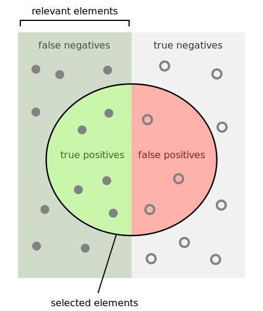
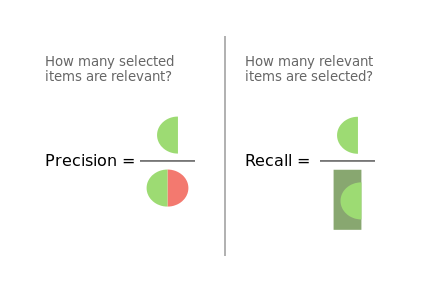

### Approach

One of the challenges to start with is which packages to use as there are a lot of packages for machine learning
in R. In this assignment, Caret package is the main package on which all work relied on and all other packages are serving its purpose. This package eases the usage of different classifers and algorithms using the same code with minor changes which is very important as there are a lot of comparisions in this assignment which is better if all was carried out using the same block of code.

#### Load libraries
```{r}
library(caret)
library(RWeka)
library(klaR)
library(randomForest)
library(rattle)
library(rpart)
library(rpart.plot)
library(kernlab)
library(ipred)
library(knitr)
```

### 1. Download the dataset and import it into R
```{r}
sonar_data = read.csv("sonar.all-data.csv")
```

### Train a C4.5classifier. Cross-validation
#### 1. Construct a C4.5 Decision Tree using the entire dataset as the learning set.
```{r ,cache =TRUE}
Results1 <- data.frame("Algorithm" = "", "Technique" = "", "Accuracy" = 0,
"Precision" = 0, "Recall" = 0, "F-Score"= 0, stringsAsFactors=FALSE)
# fit model
base_model <- train(R~., data=sonar_data, method="J48")
# summarize the results
summary(base_model)
predictions <- predict(base_model, sonar_data[,1:length(sonar_data)])
# summarize accuracy
confusion_matrix <- as.data.frame(table(predictions, sonar_data$R))
colnames(confusion_matrix) <- c("table.Prediction","table.Reference","table.Freq")
print(confusion_matrix)
```

#### Equations used to calculate accuracy, precision, recall and f-score

$$ accuracy =  (true positives + true negatives)  /  total $$

$$ precision= true positives / (true positives + false positives) $$ 

$$ recall = true positives / (true positives +false negatives) $$

$$ F-score = 2 *  ((precision * recall) / (precision + recall)) $$

 

```{r, cache =TRUE}
accuracy = ((confusion_matrix$table.Freq[1] + confusion_matrix$table.Freq[4]) / sum(confusion_matrix$table.Freq)) * 100
precision = (confusion_matrix$table.Freq[1] / (confusion_matrix$table.Freq[1] + confusion_matrix$table.Freq[3])) * 100
recall =  (confusion_matrix$table.Freq[1] / (confusion_matrix$table.Freq[1] + confusion_matrix$table.Freq[2])) * 100
f_score = 2 * ((precision * recall) /(precision + recall))
Results1 <- rbind(Results1,setNames(as.list(c("J48","base_model",accuracy,precision,recall,f_score)), names(Results1)))
```

### 2. Test C4.5 classifier using a 10-fold cross-validation

```{r, warning=FALSE, cache =TRUE}
k_fold_cross_validation_model <-  J48(R ~ ., sonar_data)
k_fold_cross_validation_model <- evaluate_Weka_classifier(k_fold_cross_validation_model, numFolds = 10)
confusion_matrix <- k_fold_cross_validation_model$confusionMatrix
confusion_matrix <- as.data.frame(confusion_matrix)
print(confusion_matrix)
TruePositive <- confusion_matrix[1, 1]
TrueNegative <- confusion_matrix[2, 2]
FalsePositive <- confusion_matrix[2, 1]
FalseNegative <- confusion_matrix[1, 2]
accuracy = ((TruePositive +  TrueNegative) / sum(TruePositive ,TrueNegative ,FalsePositive ,FalseNegative)) * 100
precision = (TruePositive  / (TruePositive  + TrueNegative)) * 100
recall =  (TruePositive  / (TruePositive  + FalseNegative )) * 100
f_score = 2 * ((precision * recall) /(precision + recall))
Results1 <- rbind(Results1,setNames(as.list(c("J48","k_fold_cross_validation_model",accuracy,precision,recall,f_score)), names(Results1)))
Results1 = Results1[-1,]
Results1 <- Results1[order(as.numeric(Results1$Accuracy), decreasing = TRUE),]
```

#### Comparision between Base Model & K Fold Cross Validation Model

```{r}
kable(Results1)
```   

The Results show that the base model is way better than the k fold validation model in terms of the accuracy, precision, recall and f-score but that is actually not true. In fact, the base model is overfitted and it would give wrong results on unknown samples. It will only give correct results on these training samples. On the other hand, the K fold Cross validation model will perform better than the base model on any other samples not in the training set so it is actually better with sets that are not included in the training set as it is not overfitted.

### 3. Train other classifiers

##### Viewing all possible algorithms to be used

```{r}
names(getModelInfo())
```

### Algorithms that are chosen for our comparison:
1. C4.5 Decision Tree (J48)
2. Random Forest(rf)
3. Support Vector Machines(svmLinear)
4. Naive Bayes (nb)
5. Neural Networks (nnet)

### Splitting the Dataset into training set (85%) and test set (15%) 

```{r, cache =FALSE}
# define an 85%/15% train/test split of the dataset
split=0.85
trainIndex <- createDataPartition(sonar_data$R, p=split, list=FALSE)
train_set <- sonar_data[ trainIndex,]
test_set <- sonar_data[-trainIndex,]
# Creating the Table containing all Results
Results2 <- data.frame("Algorithm" = "", "Technique" = "", "Accuracy" = 0,
"Precision" = 0, "Recall" = 0, "F-Score"= 0, stringsAsFactors=FALSE)
```

### Training the base C4.5 model

This is the C4.5 base model but this time it is trained on 85% of the dataset and tested on the other 15%, this will be compared to C4.5 with 10-fold cross-validation against other classifiers in addition to applying boosting and bagging.

```{r, cache = FALSE}
base_model <- J48(R~., data=train_set)
# summarize the results
summary(base_model)
# make predictions
predictions <- predict(base_model, test_set[,1:length(test_set-1)])
# summarize accuracy
confusion_matrix <- as.data.frame(table(predictions, test_set$R))
colnames(confusion_matrix) <- c("table.Prediction","table.Reference","table.Freq")
accuracy = ((confusion_matrix$table.Freq[1] + confusion_matrix$table.Freq[4]) / sum(confusion_matrix$table.Freq)) * 100
precision = (confusion_matrix$table.Freq[1] / (confusion_matrix$table.Freq[1] + confusion_matrix$table.Freq[3])) * 100
recall =  (confusion_matrix$table.Freq[1] / (confusion_matrix$table.Freq[1] + confusion_matrix$table.Freq[2])) * 100
f_score = 2 * ((precision * recall) /(precision + recall))
Results2 <- rbind(Results2,setNames(as.list(c("J48","base_model",accuracy,precision,recall,f_score)), names(Results2)))

k_fold_cross_validation_model <-  J48(R ~ ., sonar_data)
k_fold_cross_validation_model <- evaluate_Weka_classifier(k_fold_cross_validation_model, numFolds = 10)
confusion_matrix <- k_fold_cross_validation_model$confusionMatrix
confusion_matrix <- as.data.frame(confusion_matrix)
print(confusion_matrix)
TruePositive <- confusion_matrix[1, 1]
TrueNegative <- confusion_matrix[2, 2]
FalsePositive <- confusion_matrix[2, 1]
FalseNegative <- confusion_matrix[1, 2]
accuracy = ((TruePositive +  TrueNegative) / sum(TruePositive ,TrueNegative ,FalsePositive ,FalseNegative)) * 100
precision = (TruePositive  / (TruePositive  + TrueNegative)) * 100
recall =  (TruePositive  / (TruePositive  + FalseNegative )) * 100
f_score = 2 * ((precision * recall) /(precision + recall))
Results2 <- rbind(Results2,setNames(as.list(c("J48","k_fold_cross_validation_model",accuracy,precision,recall,f_score)), names(Results2)))
```

### Training the 10-cross validation C4.5 model and training with the other algorithms as well and also applying bagging and boosting.

```{r, warning=FALSE, results='hide', cache =FALSE}
#the algorithms that will be used
algorithms <- c("rf","svmLinear","nb","nnet")

# define training control
train_control <- trainControl(method="repeatedcv", number=10, repeats=10)
for(i in algorithms) {
	print(i)
	k_fold_cross_validation_model <- train(R~., data=train_set, trControl=train_control, method=i)
	# summarize results
	if( i =="nb")
		confusion_matrix <- as.data.frame(table(predict(k_fold_cross_validation_model$finalModel,test_set)$class, test_set$R))
	else if (i== "svmLinear" | i== "nnet")
		confusion_matrix <- as.data.frame(confusionMatrix(k_fold_cross_validation_model)$table)
	else
		confusion_matrix <- as.data.frame(table(predict(k_fold_cross_validation_model,test_set), test_set$R))
	colnames(confusion_matrix) <- c("table.Prediction","table.Reference","table.Freq")
	accuracy = ((confusion_matrix$table.Freq[1] + confusion_matrix$table.Freq[4]) / sum(confusion_matrix$table.Freq)) * 100
	precision = (confusion_matrix$table.Freq[1] / (confusion_matrix$table.Freq[1] + confusion_matrix$table.Freq[3])) * 100
	recall =  (confusion_matrix$table.Freq[1] / (confusion_matrix$table.Freq[1] + confusion_matrix$table.Freq[2])) * 100
	f_score = 2 * ((precision * recall) /(precision + recall))
	Results2 <- rbind(Results2,setNames(as.list(c(i,"k_fold_cross_validation_model",accuracy,precision,recall,f_score)), names(Results2)))
}
```

### Applying Bagging Technique

```{r, warning=FALSE, results='hide', cache =FALSE}
# For Bagging
# fit model
fit <- bagging(R~., data=train_set)
# summarize the fit
summary(fit)
# make predictions
predictions <- predict(fit, test_set[,1:length(test_set)], type="class")
# summarize accuracy
confusion_matrix <- as.data.frame(table(predictions, test_set$R))
colnames(confusion_matrix) <- c("table.Prediction","table.Reference","table.Freq")
accuracy = ((confusion_matrix$table.Freq[1] + confusion_matrix$table.Freq[4]) / sum(confusion_matrix$table.Freq)) * 100
precision = (confusion_matrix$table.Freq[1] / (confusion_matrix$table.Freq[1] + confusion_matrix$table.Freq[3])) * 100
recall =  (confusion_matrix$table.Freq[1] / (confusion_matrix$table.Freq[1] + confusion_matrix$table.Freq[2])) * 100
f_score = 2 * ((precision * recall) /(precision + recall))
Results2 <- rbind(Results2,setNames(as.list(c("Bagging","base_model",accuracy,precision,recall,f_score)), names(Results2)))
confusion <- function(a, b){
	tbl <- table(a, b)
	mis <- 1 - sum(diag(tbl))/sum(tbl)
	list(table = tbl, misclass.prob = mis)
}
```

## Applying Boosting Technique

```{r, warning=FALSE, results='hide' , cache =FALSE}
# For Boosting
fit <- rpart(as.factor(R) ~ ., train_set, control=rpart.control(cp=.01))
```

### Classification Tree
```{r}
fancyRpartPlot(fit)
```

```{r, warning=FALSE, results='hide', cache =FALSE}
confusion_matrix <- as.data.frame(confusion(predict(fit, test_set, type="class"), as.factor(test_set$R))$table)
colnames(confusion_matrix) <- c("table.Prediction","table.Reference","table.Freq")
accuracy = ((confusion_matrix$table.Freq[1] + confusion_matrix$table.Freq[4]) / sum(confusion_matrix$table.Freq)) * 100
precision = (confusion_matrix$table.Freq[1] / (confusion_matrix$table.Freq[1] + confusion_matrix$table.Freq[3])) * 100
recall =  (confusion_matrix$table.Freq[1] / (confusion_matrix$table.Freq[1] + confusion_matrix$table.Freq[2])) * 100
f_score = 2 * ((precision * recall) /(precision + recall))
Results2 <- rbind(Results2,setNames(as.list(c("Boosting","base_model",accuracy,precision,recall,f_score)), names(Results2)))
Results2 = Results2[-1,]
Results2 <- Results2[order(as.numeric(Results2$Accuracy), decreasing = TRUE),]
```

```{r}
kable(Results2)
```

The results show that k fold cross validation and the base model are now closer when the data is split which proves that in the previous test, the base model performs better because it is overfitted, the k fold cross validation is better on unknown sets.The results shows as well that using bagging is better than the C4 base model which proves it is a good technique to be used. For the comparison between the classifiers themselves,there are classifers with higher accuracy than other. The question is "Does that prove that they are better than the others or is it coincidence?". To answer this question, these classifiers will be tested on other datasets to see if they will perform differently. The performance of the classifier may rely on the nature or structure of the data itself.

### 4. Test multiple algorithms on multiple datasets. Statistically significant results

```{r, warning=FALSE,results='hide', cache=TRUE}
# Creating the Table containing all Results
Results3 <- data.frame("DataSetName" = "", "Algorithm" = "", "Technique" = 0, "Accuracy" = 0,
"Precision" = 0, "Recall" = 0, "F-Score"= 0, stringsAsFactors=FALSE)

#the datasets & algorithms that will be used
datasets <- c("sonar.all-data","hepatitis.data","pima-indians-diabetes.data","SPECT.train")
algorithms<- c("J48","rf","svmLinear","nb","nnet")

#handling missing values before training
f=function(x){
	#first convert each column into numeric if it is from factor
	x<-as.numeric(as.character(x)) 
	#convert the item with NA to median value from the column
	x[is.na(x)] =mean(x, na.rm=TRUE) 
	#display the column
	x
}

# define training control
train_control <- trainControl(method="repeatedcv", number=10, repeats=10)
for(data in datasets){
	dataset = read.csv(paste(data, ".csv", sep = ""))
	if(data == "SPECT.train")
	{
		dataset_test = read.csv("SPECT.test.csv")
		colnames(dataset_test) =  colnames(dataset)
		dataset <- rbind(dataset, dataset_test)
	}
	nms <- colnames(dataset)
	names(dataset)[names(dataset) == nms[length(nms)]] <- 'Target'
	dataset$Target <- as.factor(dataset$Target)
	if(data == "hepatitis.data") {
		dataset[dataset == "?"] <- NA
		dataset <- data.frame(apply(dataset,2,f))
		dataset$Target = as.factor(dataset$Target)
	}
	split=0.85
	trainIndex <- createDataPartition(dataset$Target, p=split, list=FALSE)
	train_set <- dataset[ trainIndex,]
	test_set <- dataset[-trainIndex,]
	for(i in algorithms) {
		k_fold_cross_validation_model <- train(Target~., data=train_set, trControl=train_control, method=i)
		test_set$Target <- as.factor(test_set$Target)
		if( i =="nb")
			confusion_matrix <- as.data.frame(table(predict(k_fold_cross_validation_model$finalModel,test_set)$class, test_set$Target))
		else if (i== "svmLinear" | i== "nnet")
		 	confusion_matrix <- as.data.frame(confusionMatrix(k_fold_cross_validation_model)$table)
		else
		 	confusion_matrix <- as.data.frame(table(predict(k_fold_cross_validation_model$finalModel,test_set), test_set$Target))
		colnames(confusion_matrix) <- c("table.Prediction","table.Reference","table.Freq")
		accuracy = ((confusion_matrix$table.Freq[1] + confusion_matrix$table.Freq[4]) / sum(confusion_matrix$table.Freq)) * 100
		precision = (confusion_matrix$table.Freq[1] / (confusion_matrix$table.Freq[1] + confusion_matrix$table.Freq[3])) * 100
		recall =  (confusion_matrix$table.Freq[1] / (confusion_matrix$table.Freq[1] + confusion_matrix$table.Freq[2])) * 100
		f_score = 2 * ((precision * recall) /(precision + recall))
		Results3 <- rbind(Results3,setNames(as.list(c(data,i,"k_fold_cross_validation_model",accuracy,precision,recall,f_score)), names(Results3)))
	}
}
Results3 = Results3[-1,]
Results3 <- Results3[order(Results3$DataSetName, as.numeric(Results3$Accuracy), decreasing = TRUE),]
Results3$DataSetName[Results3$DataSetName == "SPECT.train"] <- "SPECT"
```

```{r}
kable(Results3)
```

## Conclusion

### Which Algorithm which performed statistically significantly better overall(has the most wins)?
From the results, the most wins is for Random Forest as it somehow keeps its accuracy on the different datasets, unlike other classifiers which performs well on a dataset and bad in another one, for example the Support Vector Machines (Linear) has the highest performance in "pima-indians-diabetes.data" dataset while its accuracy is really bad in "sonar.all-data" dataset

### Is there a clear and only winner?
From the above results, it is clear there no classifer that is performing very well on all datasets, the performance of the classifier depends on the dataset itself. Each algorithm performs well on specific kind of datasets so analysing the dataset before deciding which algorithm to use is very important

### The analysis on multiple measures(precision, recall,f-score).

```{r}
Results3 <- Results3[order(Results3$DataSetName, as.numeric(Results3$Precision), decreasing = TRUE),]
kable(Results3)
Results3 <- Results3[order(Results3$DataSetName, as.numeric(Results3$Recall), decreasing = TRUE),]
kable(Results3)
Results3 <- Results3[order(Results3$DataSetName, as.numeric(Results3$F.Score), decreasing = TRUE),]
kable(Results3)
```

### Sonar Dataset
RandomForest is better in every metric except recall in which Neural Networks is better.

### Hepatitis
Naive Bayes is dominating all other classifiers apart from Precision in which SVM is a little better.

### Pima Indians
Naive Bayes & SVM are in great competetion as Naive Bayes is better in terms of accuracy and precision while 
SVM has better results in recall and fscore but overall both classifers are equally the same.

### SPECT
Same like with Sonar Data set, RandomForest is better in every metric except recall in which Naive Bayes is better.